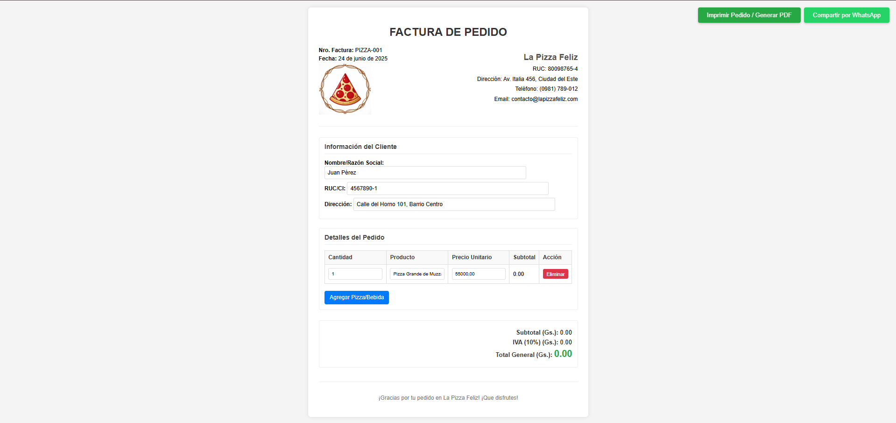

# Factura Electronica 

Este proyecto es un sistema básico de facturación electrónica desarrollado con HTML, CSS y JavaScript. Permite generar, visualizar y descargar facturas en formato electrónico, simulando un proceso de compra con cálculos automáticos de subtotal, impuestos y total.

Características principales:
✅ Interfaz intuitiva diseñada con CSS moderno.
✅ Cálculo automático de impuestos (IVA) y totales.
✅ Validación de campos para evitar errores en los datos.
✅ Generación de factura en PDF.

🤖Tecnologías utilizadas:

HTML5 (Estructura semántica).

CSS3 (Flexbox, Grid, Diseño responsive).

JavaScript (Lógica de negocio, eventos y manipulación del DOM).

🧐Cómo usar:

Clona o descarga el repositorio.

Abre el archivo index.html en tu navegador.

Completa los datos del cliente y los productos.

Genera la factura y descárgala en PDF.

## Screenshots

